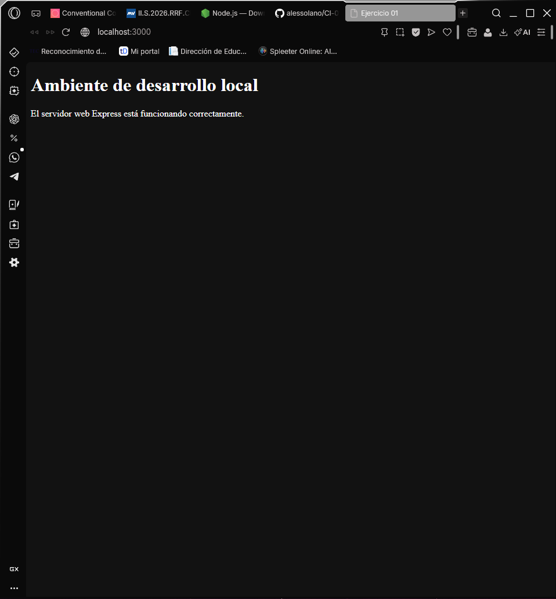

# Ejercicio 01 — Ambiente de desarrollo local

## Servidor web seleccionado

Para este ejercicio se utilizó **Express**, un framework de servidor web que funciona sobre Node.js.

## Razón de elección

Se escogió Express porque es una herramienta ligera, flexible y sencilla de configurar. Permite crear un servidor web local con pocas líneas de código y dispone del middleware `express.static`, que facilita servir archivos HTML, CSS, JavaScript e imágenes desde una carpeta determinada. Además, su integración con Node.js y npm permite administrar fácilmente las dependencias y comandos del proyecto.

Además de estas razones, se escogió Express dado que Node.js se utilizará no solo en el curso de Desarrollo de Aplicaciones Web, sino también para el curso de P.I de Ing. Software y Bases de datos, pues es una herramienta seleccionada por mi equipo de trabajo. Esto hace que sea bueno irse familiarizando con estas herramientas para un futuro.

## Puerto utilizado

El servidor fue configurado para utilizar el puerto:

```text
3000
```

Se seleccionó este puerto porque puede utilizarse sin requerir permisos administrativos adicionales en el sistema operativo.

## URL

El contenido del sitio se puede visualizar localmente mediante la siguiente dirección:

http://localhost:3000/

## Configuración

Express fue instalado como una dependencia local del proyecto mediante npm. En la raíz del repositorio se creó el archivo `server.js`, encargado de inicializar el servidor web.

El servidor utiliza `express.static` para servir los archivos ubicados en la carpeta `ejercicio-01/` del repositorio. Para construir esta ruta se utilizó el módulo `path` de Node.js, lo que permite localizar correctamente la carpeta independientemente de la ubicación absoluta del repositorio en la computadora.

El servidor escucha las solicitudes realizadas al puerto `3000`. Al acceder a `http://localhost:3000/`, Express busca y muestra el archivo `index.html` ubicado dentro de `ejercicio-01/`.

También se agregó la carpeta `node_modules/` al archivo `.gitignore`, debido a que las dependencias pueden volver a instalarse a partir de los archivos `package.json` y `package-lock.json` y no deben almacenarse directamente en el repositorio.

## Ejecución local

Desde la raíz del repositorio, las dependencias se pueden instalar mediante:

```bash
npm install
```

Para iniciar el servidor se utiliza:

```bash
npm start
```

Mientras el servidor se encuentre activo, el sitio estará disponible en:

```text
http://localhost:3000/
```

## Evidencia

La siguiente captura demuestra que el contenido del repositorio puede visualizarse correctamente mediante el servidor web local:


